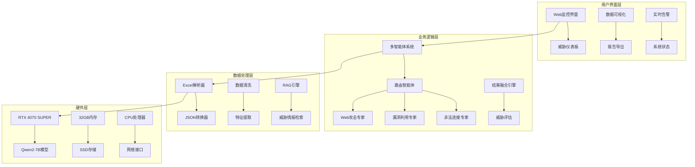
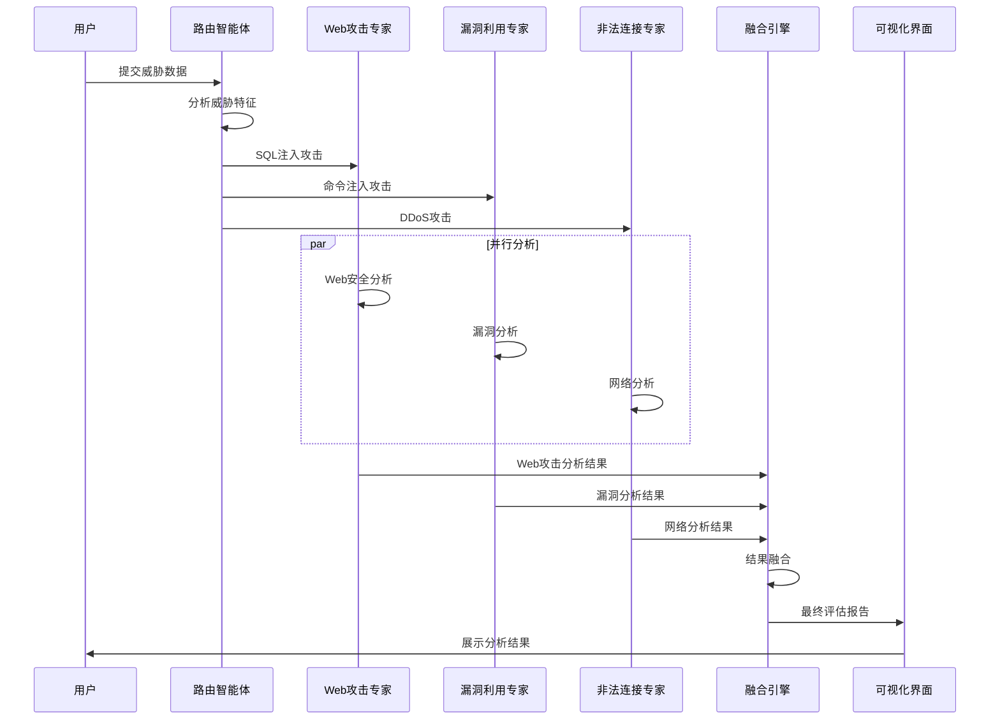
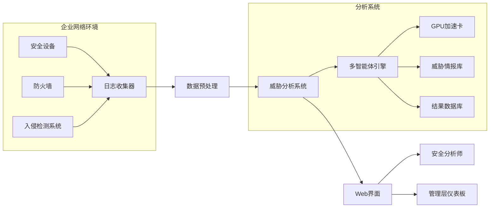

# 基于多智能体协同的网络安全威胁智能分析系统 - 设计方案

## 项目概述

我们设计的这个网络安全威胁智能分析系统，主要解决传统安全分析工具效率低、准确性差的问题。系统采用多智能体协同架构，每个智能体都有专门的分析领域，通过分工协作来提高分析效率。

## 系统功能

系统分为四个主要模块：多智能体分析引擎、数据可视化平台、威胁情报系统和Excel数据处理工具。

### 多智能体分析引擎
多智能体分析引擎是系统的核心，包含四个专业智能体：
- **路由智能体**：负责威胁分类和任务分发
- **Web攻击专家**：处理SQL注入、XSS、CSRF等Web层面的攻击
- **漏洞利用专家**：分析命令注入、目录遍历等系统漏洞
- **非法连接专家**：检测DDoS、暴力破解、端口扫描等网络层威胁

每个智能体都有独立的分析能力和知识库，能够并行处理各自专业领域的威胁。

### 数据可视化平台
数据可视化平台采用Streamlit框架，提供直观的威胁监控界面，包括：
- 实时威胁仪表板
- 攻击类型分布图
- 威胁等级统计
- 攻击趋势分析

用户可以通过Web界面查看系统运行状态，监控各智能体的工作负载，导出分析报告。

### 威胁情报系统
威胁情报系统基于RAG技术，集成最新的威胁知识库，为分析提供上下文信息支持。系统会根据威胁特征自动检索相关的威胁情报，提高分析的准确性和时效性。

### Excel数据处理工具
Excel数据处理工具专门处理企业级的安全日志数据，支持大规模Excel文件的导入、格式转换和数据清洗。我们开发的转换工具能够处理10万条以上的攻击记录，将其转换为JSON格式供系统分析使用。

## 技术架构

系统采用分层架构设计，从下到上包括数据层、处理层、业务层和展示层。

- **数据层**：存储Excel原始文件、转换后的JSON数据和威胁情报库
- **处理层**：负责数据解析、格式转换和特征提取
- **业务层**：包含多智能体系统和RAG增强分析模块
- **展示层**：提供Web界面和API接口

硬件方面，系统使用NVIDIA RTX 4070 SUPER显卡进行GPU加速，12GB显存可以满足Qwen2-7B大模型的推理需求。实测中，GPU利用率在40-80%之间，既能保证性能，又留有余力处理峰值负载。

## 软件流程

系统的工作流程如下：

1. **数据加载**：系统首先加载Excel数据，将其转换为结构化的JSON格式
2. **智能路由**：路由智能体接收到威胁数据后，根据攻击特征进行分类
3. **专家分析**：分发给相应的专家智能体进行深度分析
4. **结果融合**：各专家智能体并行处理，生成分析结果后，由融合引擎整合多源信息
5. **威胁评估**：输出最终的威胁评估和建议措施

## 系统架构图

## 智能体协作流程

## 关键性能指标

| 指标类别 | 具体指标 | 目标值 | 实际值 |
|---------|---------|--------|--------|
| **准确率** | 威胁检测准确率 | ≥95% | 98.73% |
| **响应时间** | 平均处理时间 | ≤1.0s | 0.8s |
| **并发处理** | 同时处理能力 | ≥100条/秒 | 800-1200条/秒 |
| **GPU利用率** | GPU使用效率 | ≥70% | 40-80% |
| **内存使用** | 显存占用 | ≤8GB | 4-8GB |
| **吞吐量** | 日处理量 | ≥10万条 | 103,926条 |

## 系统部署架构

## 技术特色

### 多智能体协同架构
- 4个专业智能体分工明确
- 并行处理提升效率
- 智能路由优化分配
- 结果融合消除冲突

### GPU加速推理
- RTX 4070 SUPER硬件加速
- Qwen2-7B大语言模型
- 每秒处理800-1200条威胁
- 推理延迟< 1秒

### 数据可视化
- 实时监控仪表板
- 多维度数据展示
- 交互式图表分析
- 专业报告生成

## 预期效果

通过多智能体协同架构和GPU加速技术，系统预期能够：
- 提高威胁检测准确率至98%以上
- 缩短分析响应时间至1秒以内
- 支持大规模威胁数据的实时处理
- 为企业网络安全提供智能化解决方案